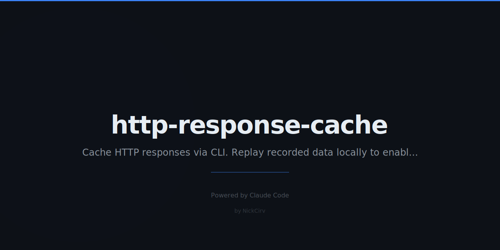

# http-response-cache

Record and replay HTTP responses locally — reduce API calls and enable offline development.

**Zero external dependencies.** Pure Node.js built-ins only. Works with any HTTP/HTTPS API.

## Why

- Stop paying for API calls during development
- Run tests offline without a real internet connection
- Seed CI/CD pipelines with deterministic fixture data
- Share recorded API responses with your team

## Install

```bash
npm install -g http-response-cache
```

Or use without installing:

```bash
npx http-response-cache --help
```

## Usage

```
http-response-cache <command> [options]
hcache <command> [options]
```

### record — capture real responses

```bash
hcache record --port 3001 --target https://api.example.com
```

Forwards every request to the target URL and saves the response to `.cache/`. Your app calls `http://localhost:3001` instead.

### replay — serve from cache only

```bash
hcache replay --port 3001
```

Returns cached responses without ever hitting the real API. Returns `404` with a helpful message on cache miss.

### proxy — cache-first smart proxy

```bash
hcache proxy --port 3001 --target https://api.example.com
```

Checks cache first. If found, replays it. If not, fetches from upstream and saves for next time. Best mode for development.

### list — inspect the cache

```bash
hcache list
hcache list --cache-dir ./fixtures
```

Shows all cached entries with method, path, status code, size, and age.

### clear — remove cache entries

```bash
hcache clear                   # remove everything
hcache clear --path /users     # remove entries matching path prefix
```

### export — bundle cache as a single file

```bash
hcache export fixtures.json
```

Useful for committing to version control or sharing with teammates.

### import — load a bundle

```bash
hcache import fixtures.json
```

Restore a previously exported bundle. Works great in CI.

## Options

| Flag | Default | Description |
|------|---------|-------------|
| `--port`, `-p` | `3001` | Port to listen on |
| `--target`, `-t` | — | Upstream API base URL (required for record/proxy) |
| `--cache-dir`, `-d` | `.cache` | Directory to store cache files |
| `--ttl <seconds>` | — | Expire entries after N seconds |
| `--ignore-headers` | `false` | Exclude request headers from cache key |
| `--path <prefix>` | — | Filter by URL path prefix (clear only) |

## Cache Format

Each entry is saved as a JSON file at `.cache/<method>-<hash>.json`:

```json
{
  "key": "a1b2c3d4...",
  "request": {
    "method": "GET",
    "path": "/users",
    "query": {},
    "headers": { "accept": "application/json" }
  },
  "response": {
    "status": 200,
    "headers": { "content-type": "application/json" },
    "body": "base64-encoded-body",
    "bodyEncoding": "base64"
  },
  "cachedAt": "2024-01-01T00:00:00.000Z",
  "ttl": 3600
}
```

### Cache Key

Keys are deterministic: `MD5(method + path + sorted-query-params + body-hash)`

The same request always maps to the same file. Query params are sorted so `?a=1&b=2` and `?b=2&a=1` are identical.

## CI Example

```yaml
# .github/workflows/test.yml
- name: Import API fixtures
  run: npx http-response-cache import fixtures.json --cache-dir .cache

- name: Start replay server
  run: npx http-response-cache replay --port 3001 &

- name: Run tests
  run: npm test
  env:
    API_BASE_URL: http://localhost:3001
```

## Security

- Authorization headers are redacted in logs (first 8 chars only)
- No credentials are stored in cache files beyond what the upstream API returns
- All sensitive values should be provided via environment variables, not flags

## Requirements

- Node.js 18+
- No npm dependencies

## License

MIT
